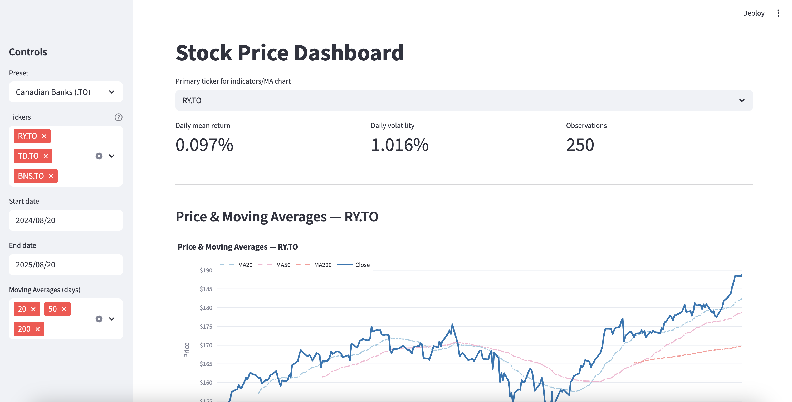
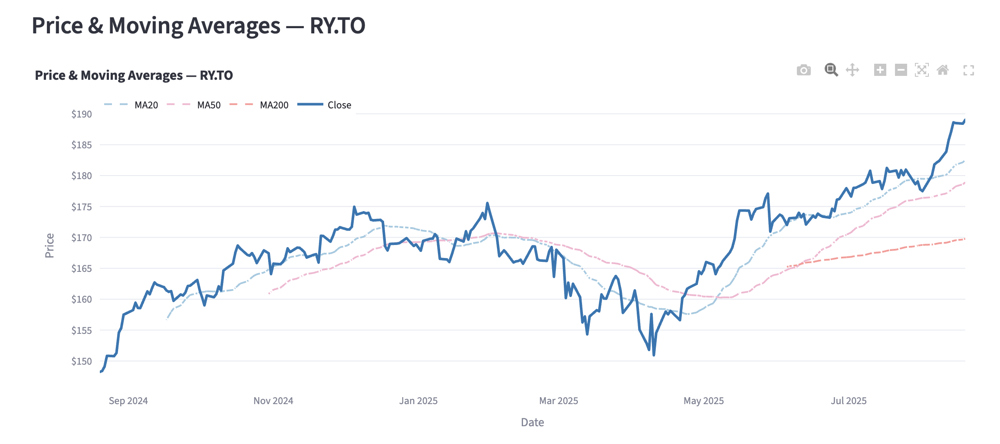
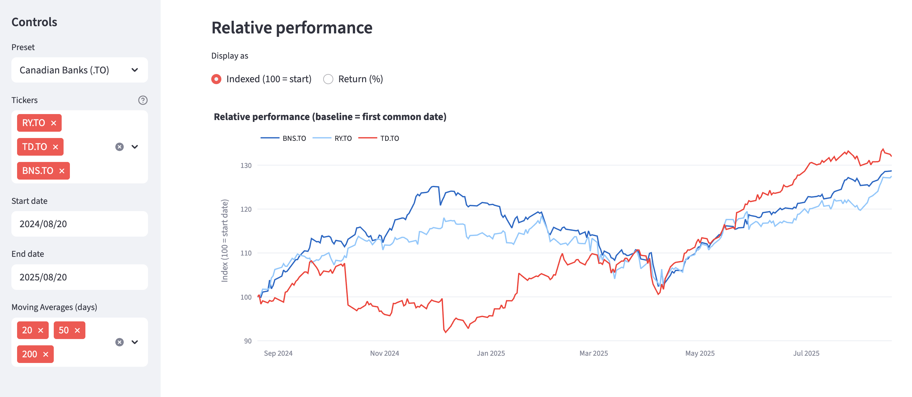
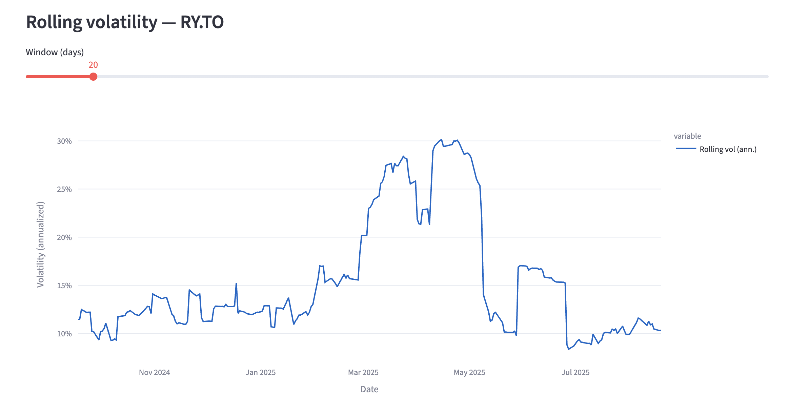
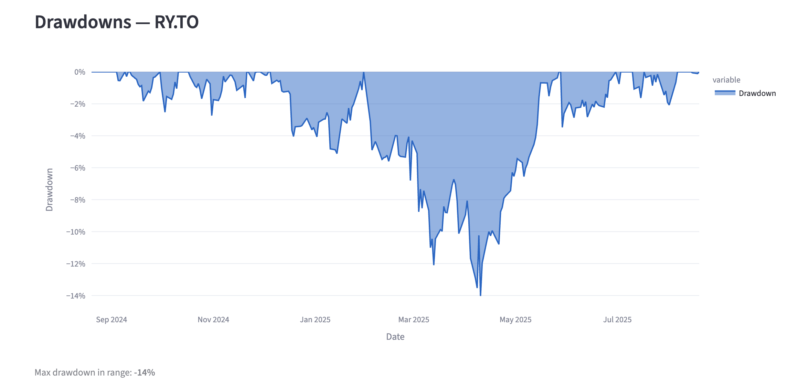

[](LICENSE)

# Stock Price Dashboard
Interactive **Streamlit** app for exploring equities: price + moving averages, relative performance (indexed or % return), **rolling volatility**, and **drawdowns**. Data via **Yahoo Finance** (`yfinance`, adjusted close). Plotting with **Plotly**.

## Features
- **Presets + pickers**: choose tickers & date range (includes Canadian banks preset)
- **Price & MAs**: 20/50/200-day moving averages with a currency-formatted Plotly chart
- **Relative performance**: toggle between **Indexed (100 = start)** or **Return (%)**
- **Risk views**:
  - **Rolling volatility (annualized)** with adjustable window
  - **Drawdowns** (peak-to-trough) + max drawdown KPI
- **KPIs**: daily mean return, daily volatility, observation count
- **Caching**: avoids re-downloading the same data (Streamlit `@st.cache_data`)

## Tech
- Python
- Streamlit 
- pandas 
- numpy 
- yfinance 
- Plotly 
- pytest 
- Makefile

## Quickstart
```bash
python3 -m venv .venv && source .venv/bin/activate
pip install -r requirements.txt
streamlit run app.py
```

## Project structure
```
.
├─ app.py                 # Streamlit UI (Plotly visuals, controls, caching)
├─ core.py                # Pure helpers: data load, returns, MAs, rolling vol, drawdown, etc.
├─ requirements.txt
├─ Makefile               # install/run/test helpers
└─ tests/
   └─ test_core.py        # unit tests for core.py helpers
```

## Screenshots

| Screenshots |
|---|
| **Top of Page & Sidebar**<br> |
| **Price & MAs**<br> |
| **Relative Performance**<br> |
| **Rolling Volatility**<br> |
| **Drawdowns**<br> |


## How to Run Testing
Option A (Makefile):
```bash
make run test
```
Option B (direct):
```bash
PYTHONPATH=. pytest -q  
```

## Screenshots

## Roadmap
- Add beta vs. market and Sharpe ratio
- Export CSV / PNG for charts and KPIs
